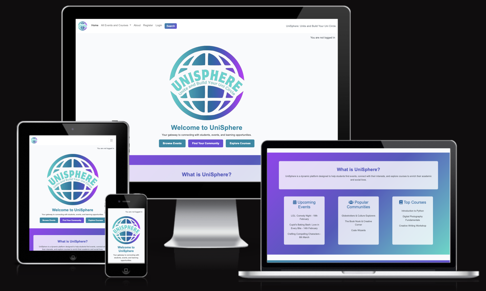
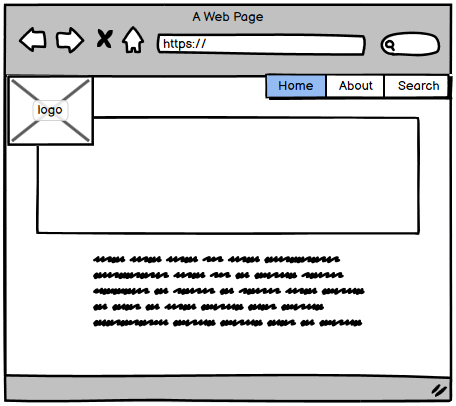
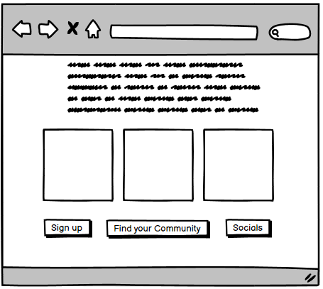
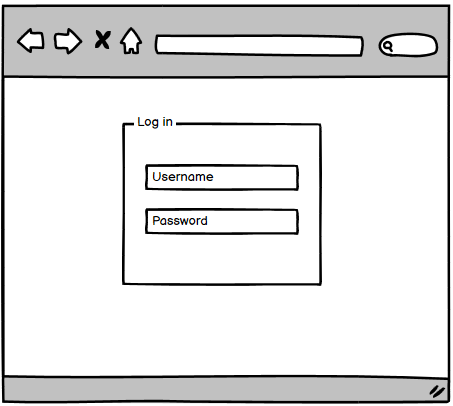
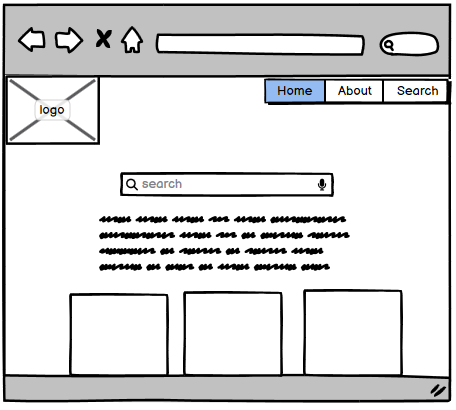
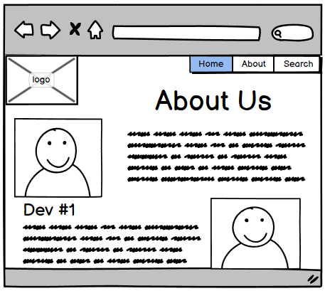
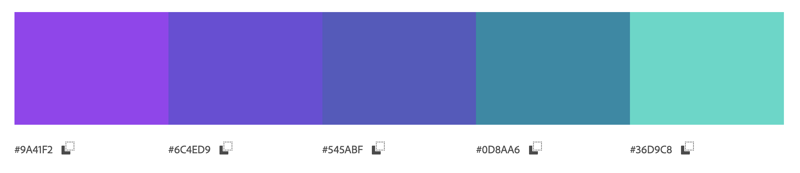

# UniSphere

Welcome to **UniSphere**! This Django-based web application is designed to connect university students with events, courses, communities, and opportunities based on their interests. Users can join and interact with campus activities, while admins can approve memberships, issue tickets, and manage events and courses.

[View the live project here](https://hackathon-unisphere-4f66f95d78e7.herokuapp.com/)
(To open in a new tab/window, press "ctrl" (or ⌘ for Mac) + click on the link)

## Table of Contents

- [About the Site](#about-the-site)
  - [Primary Goal](#primary-goal)
  - [Target Users](#target-users)
- [Agile Methodology](#agile-methodology)
  - [Workflow Breakdown](#workflow-breakdown)
  - [All User Stories](#all-user-stories)
- [Five Planes of User Experience (UX)](#five-planes-of-ux)
  - [1. Strategy Plane](#1-strategy-plane)
    - [1.1 Goal](#11-goal)
    - [1.2 User Needs](#12-user-needs)
    - [1.3 Business Goals](#13-business-goals)
  - [2. Scope Plane](#2-scope-plane)
    - [2.1 Key Existing Features](#21-key-existing-features)
    - [2.2 CRUD Functionality for Key Features](#22-crud-functionality-for-key-features)
    - [2.3 Out of Scope](#23-out-of-scope)
  - [3. Structure Plane](#3-structure-plane)
    - [3.1 Backend Database Structure](#31-backend-database-structure)
    - [3.2 Frontend Website Structure](#32-frontend-website-structure)
  - [4. Skeleton Plane](#4-skeleton-plane)
    - [4.1 Layout Design](#41-layout-design)
    - [4.2 Desktop, Tablet & Mobile View](#42-desktop-tablet--mobile-view)
  - [5. Surface Plane](#5-surface-plane)
    - [5.1 Wireframes](#51-wireframes)
    - [5.2 Color Scheme](#52-color-scheme)
    - [5.3 Typography](#53-typography)
    - [5.4 Imagery](#54-imagery)
- [Technologies Used](#technologies-used)
- [Testing](#testing)
- [Deployment](#deployment)
- [Credits](#credits)

## About the Site

### Primary Goal

The goal of **UniSphere** is to help university students stay connected with the campus community by providing a platform where they can view and join events, courses, and communities based on their interests. The platform also allows admins and event organizers to manage and approve activities, issue tickets, and provide opportunities for student engagement.

### Target Users

UniSphere is designed for:

- **University students** looking for events, courses, and communities to join based on their interests.
- **Event organizers** and **admins** who manage and approve events, courses, and community memberships.
- **Faculty and staff** who want to engage with students through academic resources and events.
- **Users** who want to rate events and interact with others in the community.

## Agile Methodology

The **UniSphere** project followed **Agile methodologies** to ensure a flexible and iterative development process. We used a [Kanban board on GitHub](https://github.com/users/joeht112/projects/3/views/1) to track user stories and manage progress in stages: "Backlog", "To Do", "In Progress", and "Done".

### Workflow Breakdown

1. **Backlog**: All user stories were initially added to the backlog and prioritized using MoSCoW (Must Have, Should Have, Could Have, Won’t Have).
2. **To Do**: Stories prioritized as "Must Have" were worked on first, followed by "Should Have" and "Could Have".
3. **In Progress**: Features under active development.
4. **Done**: Stories moved here once all acceptance criteria were met and tested.

### **All User Stories**

| #  | Title of User Story                                      | MoSCoW Prioritization | Sprint Number |
|----|----------------------------------------------------------|------------------------|---------------|
| 1  | View all events, courses, and communities                | Must Have              | Sprint 1      |
| 2  | Request to join events, courses, and communities         | Must Have              | Sprint 1      |
| 3  | Admins approve and issue tickets                         | Must Have              | Sprint 1      |
| 4  | Admin can add and manage events, courses, and communities| Must Have              | Sprint 1      |
| 5  | View and edit user profile                               | Should Have            | Sprint 2      |
| 6  | View events, courses, and communities based on interests| Should Have            | Sprint 2      |
| 7  | Add events, courses, and communities as an organizer     | Should Have            | Sprint 2      |
| 8  | Rate an event                                            | Could Have             | Sprint 3      |
| 9  | View About page with developer info                      | Could Have             | Sprint 3      |
| 10 | Implement interest-based event and course matching      | Won’t Have             

## User Experience (UX)

### **Five Planes of UX**

### 1. Strategy Plane

#### 1.1 Goal:
To connect university students with events, courses, and communities based on their interests.

#### 1.2 User Needs:
- Easily discover events, courses, and communities aligned with their interests.
- Request to join events, courses, and communities.
- Rate events to share feedback.
- Manage their profile, including personal details and interests.

#### 1.3 Business Goals:
- Increase student engagement with campus activities.
- Allow admins and organizers to easily manage and approve events, courses, and communities.
- Provide a platform for collaboration and networking among students.

### 2. Scope Plane

#### 2.1 Key Existing Features

1. **Event Listings**: Users can view a list of all available events, courses, and communities.
2. **Request to Join**: Users can request to join events and communities, with admins approving or rejecting requests.
3. **Event Rating**: Users can rate events they've attended to provide feedback to organizers.
4. **Profile Management**: Users can view and edit their profile information.
5. **Admin and Organizer Access**: Admins and organizers can manage events, approve users, and issue tickets.

#### 2.2 CRUD Functionality for Key Features
**Admin and organiser**
| Feature                | Create | Read | Update | Delete |
|------------------------|--------|------|--------|--------|
| Events                 | ✅     | ✅   | ✅     | ✅     |
| Courses                | ✅     | ✅   | ✅     | ✅     |
| Communities            | ✅     | ✅   | ✅     | ✅     |
| User Profiles          | ✅     | ✅   | ✅     | ✅     |
| Tickets                | ✅     | ✅   | ✅     | ✅     |

**User**
| Feature                | Create | Read | Update | Delete |
|------------------------|--------|------|--------|--------|
| Events                 | ❌     | ✅   | ❌     | ❌     |
| Courses                | ❌     | ✅   | ❌     | ❌     |
| Communities            | ❌     | ✅   | ❌     | ❌     |
| User Profiles          | ✅     | ✅   | ✅     | ✅     |
| Request for Tickets    | ✅     | ✅   | ❌     | ❌     | 
| Rating for Events      | ✅     | ✅   | ❌     | ❌     | 

#### 2.3 Out of Scope:
- Integration with external campus systems.
- Real-time notifications or messaging systems.
- User-generated content outside of event ratings and comments.

### 3. Structure Plane

**The Backend Database Structure:**

The database structure includes models for users, events, courses, communities, tickets, and ratings. These models are interconnected to facilitate easy querying and management of data.

**The Frontend Website Structure:**

- **Landing Page**: Highlights the key features of the platform, including available events, courses, and communities.
- **Event Listing Page**: Displays a list of events that users can browse and join.
- **Community Page**: Lists communities users can join and participate in.
- **Profile Page**: Allows users to view and edit their personal information and interests; and view upcoming events and previous ratings.

### 4. Skeleton Plane

#### 4.1 Layout Design:
- Clean and responsive layout with a focus on user experience.
- Simple navigation and intuitive forms for joining events and managing profiles.

#### 4.2 Desktop, Tablet & Mobile View:
The site is designed to be responsive across all device sizes using Bootstrap 5. Key features include a collapsible navbar, flexible grids, and mobile-first design principles.

### 5. Surface Plane

#### 5.1 Wireframes:
Home page

Home page 2

Sign in page

Events page

About page

#### 5.2 Color Scheme:
The site uses a professional and modern color scheme to match the academic nature of the platform.

#### 5.3 Typography:
We use **Arial** and **Sans-serif** fonts for a clean, readable interface.

#### 5.4 Imagery:
Images include event-related photos, icons, and profile pictures.

## Technologies Used

### Languages Used

- HTML5
- CSS3
- JavaScript
- Python (Django)

### Frameworks, Libraries & Programs Used

- Django
- PostgreSQL
- Bootstrap 5
- Cloudinary (for image management)
- GitHub (for version control)

## Testing

- **Manual testing** for responsiveness, accessibility, and cross-browser functionality.

## Deployment

### Deploying to Heroku

1. Create a Heroku app and connect it to the GitHub repository.
2. Add the necessary environment variables for database and Cloudinary.
3. Deploy the app to Heroku.

## Credits

### Code
- Developed using Django and Bootstrap for web development.

### Media
- Images sourced from icons from [FontAwesome](https://fontawesome.com/).
- Logo and favicon were created by Waiyi using Adobe.
